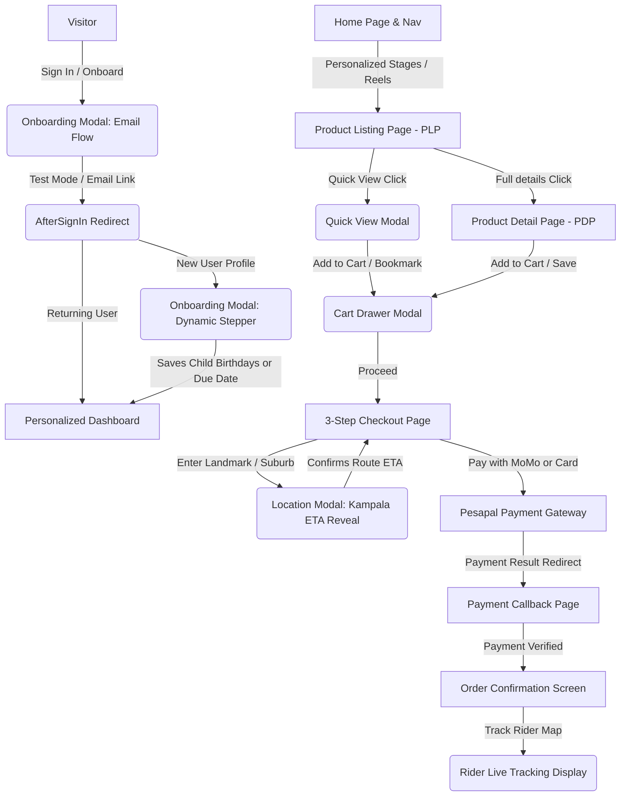

# 🧭 Dennan Kids — Comprehensive Feature & Architecture Summary

This artifact provides an exhaustive summary of the entire frontend architecture, database interfaces, premium features, dynamic pages, and interactive modals implemented within the Dennan Kids e-commerce platform.

---

## 🗺️ Visual User Flow & Integration Map

The diagram below maps how the interactive pages, modals, and backend flows interconnect to create a seamless e-commerce journey:

---

## 🗂️ Interactive Modals Directory

We prioritize lightweight overlays over structural redirection to preserve user context. Below are the key modals implemented in the system:

### 1. 👶 Onboarding Modal (`OnboardingModal.jsx`)
* **Purpose:** Serves as the global gatekeeper for user configuration and authentication in place of a separate onboarding page. Accessible globally via the primary navigation.
* **Dual-Flow Architecture:**
  * **Unauthenticated Visitor Flow:** Prompts for email entry to issue a Magic Sign-In link.
    * **Test Mode integration:** Features an embedded **direct capture toggle** that polls the local Convex database and displays a "Login Directly" link instantly inside the modal, removing the need to exit the browser during testing.
  * **Authenticated Personalization Stepper:**
    * **Step 1 (Role Selection):** User identifies as either `Expecting` (Pregnant & preparing) or `Parent` (Child is here).
    * **Step 2 (Milestone Details):** 
      * *Expecting:* Date input for expected due date (dynamically bounded between *today* and *10 months in the future*).
      * *Parent:* Dynamic birthday picker allowing users to configure up to 5 children (bounded between *today* and *12 years ago*). Includes interactive "Add another child" actions.
    * **Step 3 (Username Choice):** Inputs a unique username visible on public gift registries and shared lists.
  * **Backend Integration:** Saves preferences using the `users.saveOnboardingJourney` mutation, updates context state in real-time, and navigates to the personalized dashboard.

### 2. ⚡ Quick View Modal (`QuickViewModal.jsx`)
* **Purpose:** Intercepts clicks on product cards within lists to configure sizes and quantity without forcing page reloads.
* **Key Features:**
  * **Real-time Inventory Check:** Disables size selectors and displays a high-visibility `Out of Stock` warning tag if product inventory is depleted.
  * **Interactive Selection Group:** In-line selector buttons for size configurations (`S`, `M`, `L`, `XL`) and quantity step buttons (`—` and `+`).
  * **Integrated Wishlist Toggle:** High-intent shortcuts allow users to toggle bookmarks directly within the Quick View frame.
  * **Micro-Animated Success Transition:** Upon hitting "Add to Cart", the modal content animates smoothly into a **Success View** showing item details, selected dimensions, and clear action routes ("Proceed to Checkout" vs. "Continue Shopping").

### 3. 🛒 Cart Drawer Modal (`CartModal.jsx` & `CartItem.jsx`)
* **Purpose:** A premium, micro-animated sliding drawer revealing the current cart summary and interactive line controls.
* **Key Features:**
  * **Viewport Lock & Backdrop Blur:** Smoothly locks body scrolling and transitions a glassmorphism overlay upon entry.
  * **Inline Stepper Adjustments:** Increment/decrement quantity controls inside each product line item.
  * **Cross-Curation Actions:** Features one-click action icons to **Save to Wishlist** (moving items out of the cart drawer) or **Move to Registry** (binding the product instantly to their baby gift registry).
  * **Smart Undo Toast:** Triggers a sliding notification prompt above the sticky summary footer when an item is removed. Users can tap "**Undo**" to instantly restore the deleted quantity.

### 4. 🗺️ Kampala Location Selector Modal (`LocationModal.jsx`)
* **Purpose:** Captures landmark-based delivery directions inside the checkout pipeline and provides dynamic travel duration projections.
* **Key Features:**
  * **Smart Landmark Search (`SmartAddressSearch.jsx`):** Features custom search auto-suggest for Kampala neighborhoods, suburbs, and delivery zones.
  * **Instant ETA Reveal Screen:** Simulates real-time routing estimation with a loader spinner before transitioning into an **ETA Reveal**. Displays computed travel duration in ultra-bold display sizing (e.g., `25 mins`), expected arrival timestamp, and a summary confirmation panel.

### 5. 💳 Order Confirmation Modal (`ConfirmationModal.jsx`)
* **Purpose:** Summarizes successful purchases, shipping ETAs, and introduces post-purchase referral modules.
* **Key Features:**
  * **Computed Arrival Countdown:** Highlights the precise expected arrival time based on neighborhood zones.
  * **Rider Action Anchors:** Large pill-shaped buttons to trigger live rider location maps or contact the delivery coordinator directly via phone.
  * **Secondary Value Promos:** Bottom grid cards offering single-click options to "Save Profile" (converting guest purchases) and "Refer a Friend" (promising a 10,000 UGX discount reward).

### 6. 🎁 Group Gifting Contribution Modal (`GroupGiftingModal.jsx`)
* **Purpose:** Enables co-funding of premium registry products by friends and family.
* **Key Features:**
  * **Interactive Math Summary:** Transparent pricing summary showing *Total Price*, *Already Contributed*, and *Remaining Balance*.
  * **Safe Contribution Input:** Captures contributor's name and amount, validation-capped at the remaining balance.

---

## 💻 Implemented Pages Directory

All page components reside in `src/pages/` and utilize standard design tokens defined in our core CSS layers (`variables.css` and `index.css`).

| Page Name | Route Path | Core Functional Features |
| :--- | :--- | :--- |
| **Home Page** | `/` | **The Personalization Engine:** Adapts dynamically to show trimester guides, stage selections, vertical video reels, and curated product collections. |
| **Product Listing Page (PLP)** | `/category/:stageId` `/collection/:collectionId` | Grid layout supporting deep filtering by brand, age appropriateness scale, pricing. Integrated quick buy badges and quick views. |
| **Product Detail Page (PDP)** | `/product/:productId` | Image carousel with shimmer skeletons, interactive Age Appropriateness slider, dynamic Delivery urgency clock, product specifications sheet, and review logs featuring **Child's Age context**. |
| **Registry Page** | `/registry` `/registry/:registryId` | Public and private baby registry dashboard. Supports product co-funding, shareable registry links, and category filtering. |
| **Wishlist Page** | `/wishlist` | Bookmarked essentials manager. Integrates **Back-In-Stock automated email alerts** for out-of-stock items and single-click cart conversions. |
| **Profile Page** | `/profile` | Complete user preferences hub. Edit contact numbers (MTN/Airtel primary momo lines), child ages, pregnancy milestones, and delivery destinations. |
| **3-Step Checkout** | `/checkout` | Stepper-guided logistics panel. Features suburb/landmark selection with Kampala delivery fee modifiers (FREE central zones vs flat UGX 5,000 elsewhere), real-time promo coupon checks, and Uganda Mobile Money input validation. |
| **Payment Callback** | `/checkout/callback` | Validates transaction responses from the Pesapal Payment Gateway. Displays spinner processing status, followed by SUCCESS (prepares order) or FAILED (returns to checkout) frames. |
| **User Dashboard** | `/dashboard` | The "Growing with You" personalized feed. Renders milestone progress trackers, check-off lists, development badges, and tailored weekly expert advice. |
| **Admin Hub** | `/admin` | Operational tools panel allowing developers to override mock states, populate databases, and test system failures. |
| **Design System Page** | `/design-system` | Sandbox highlighting spacing configurations, typographic hierarchy, button states, color swatches, form components, and cards. |

---

## 🛡️ Embedded Micro-Interactions & Optimizations

1. **Local Shimmer Skeletons:** Global views utilize tailored loaders (`HomeSkeleton.jsx`, `PDPSkeleton.jsx`, `CheckoutSkeleton.jsx`) to simulate layout shapes and prevent layout shifts during queries.
2. **Uganda Phone Validation:** Inside checkout, the momo input strictly filters and validates MTN and Airtel lines (`77`, `78`, `76` for MTN and `70`, `75`, `74` for Airtel) to prevent payment failure before contacting the API.
3. **Continuous Scroll Animations:** Intersections are observed on PDP tabs and info panels, applying staggered fade-in animations on scroll (`stagger-target`).
4. **Dynamic Price Hydration:** Ensures calculated prices automatically deduct promo/referral code discounts before processing grand totals.
