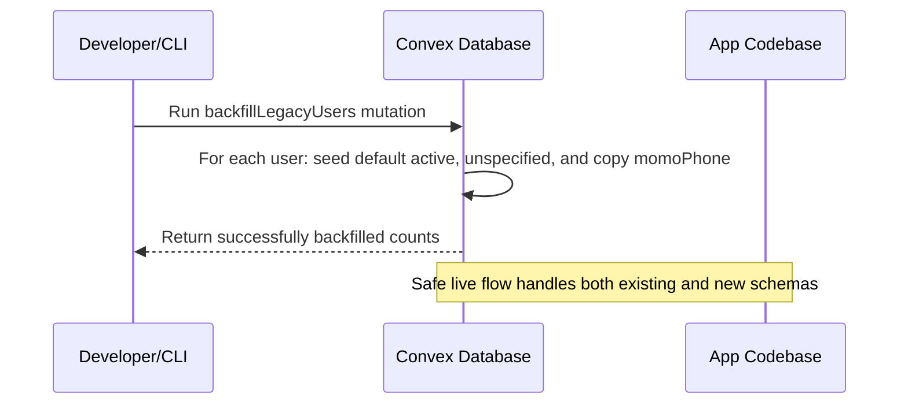

# Personalisation Milestone: Schema & Frontend Integration

This folder and document contain the blueprints, scripts, and components for implementing customer personalization fields:

## 1. Identity & Demographics (Live Flow & Input Driven)
1. **`phone`** (Completed ✅ — Sourced from legacy `momoPhone` backfill and live profile forms)
2. **`accountStatus`** (Completed ✅ — Defaulted to `"active"`, checks for `"suspended"`, automated inactivity transitions)
3. **`preferredContact`** (Completed ✅ — Onboarding preferences and Profile settings)
4. **`dob`** (Completed ✅ — User personal identity date picker with age constraints)
5. **`gender`** (Completed ✅ — Responsive grid select picker on Profile & double-input child rows on Onboarding)

---

## 2. Location & Behavior-Learned (Automated Background Pipeline)
6. **`city`** (Completed ✅ — Derived from default shipping `region` on checkout using central maps)
7. **`region`** (Completed ✅ — Sourced from default checkout shipping zone)
8. **`householdSize`** (Completed ✅ — Dynamic analytical fallback resolver calculated as `2 + children.length`)
9. **`pricePreference`** (Completed ✅ — Calculated from order LTV & AOV trends, categorized into budget/mid/premium)
10. **`preferredCategories`** (Completed ✅ — Learns user's top 3 most frequently purchased categories)
11. **`preferredBrands`** (Completed ✅ — Learns user's top 3 most frequently purchased brand IDs)
12. **`sizePrefs`** (Completed ✅ — Learns user's most commonly purchased sizes)
13. **`colorPrefs`** (Completed ✅ — Learns user's most commonly purchased product colors)

---

## 3. Database Schema & Backfill Migration

We operate on the Convex schema defined in `convex/schema.ts` and run a one-time migration to backfill all legacy users.



---

## 4. Completed Work & Implementation Log

### 🚀 Backend & Convex API
- [x] **Convex Schema**: Support user DOB/gender and custom child genders inside the `children` array:
  ```typescript
  children: v.optional(v.array(v.object({ dob: v.string(), gender: v.optional(v.union(v.literal("boy"), v.literal("girl"), v.literal("unspecified"))) })))
  ```
- [x] **API Mutations**: Updated onboarding, profile, and order mutations inside `convex/users.ts` and `convex/orders.ts` to fully validate and write user/child genders, preferred communication, and loyalty points rewards.
- [x] **Behavioral Recalculation Worker**: Added the `recalculateUserBehavioralPreferences` mutation inside `convex/users.ts` to aggregate order histories and cache spending tier, categories, brands, sizes, and colors on successful orders.
- [x] **Post-Order Trigger Hook**: Integrated checkout triggers inside `placeOrder` (`convex/orders.ts`) to calculate loyalty points, award them to the user's profile, record a `loyaltyTransactions` entry, and trigger preference calculations upon successful checkouts.

### 🎨 Frontend Integration
- [x] **Preferred Communication Select Input**: Integrated the `preferredContact` selection state, hydration, mutation payload, change tracking, and responsive 2-column styling directly below the personal identity section in `ProfilePage.jsx`.
- [x] **Post-Checkout Preferred Communication Card**: Appended an inline glassmorphic card inside the checkout order confirmation view that prompts authenticated users with missing contact channels to set their preference. Saves immediately to their profile, displays a Toast notification, and fades out permanently (will never show again).
- [x] **Double-Input Child Onboarding Row**: Added an optional gender dropdown directly beside each child's DOB picker, aligned on a single row in `OnboardingModal.jsx`.
- [x] **3-Column Personal Identity Grid**: Restructured `ProfilePage.jsx` using responsive CSS grids (`.profile-identity-subgrid`) to align `Full Name`, `Date of Birth`, and `Gender` cleanly, stacking vertically on mobile viewports.
- [x] **Child DOB & Gender Grid**: Overhauled profile child rows to couple DOB and Gender select boxes side-by-side on a single line, stacking them cleanly on small screens.
- [x] **Premium Brand Colors Dropdown**: Disabled native select dropdown arrows and added custom, dynamically loaded SVG chevrons styled in brand pink (`#d35097`) with low-surface container dropdown menus.
- [x] **Premium Glassmorphic Loyalty Points celebratory Popup**: Created a visually stunning glassmorphic celebratory modal (`LoyaltyPointsModal.jsx` and `LoyaltyPointsModal.css`) featuring custom CSS animations (dashed spinning ring, pulsating star coin, and floating sparkles) displaying loyalty points earned ($\lfloor \text{Grand Total} / 1000 \rfloor$) upon successful checkout. Integrated it for both authenticated orders and guest simulations in `CheckoutPage.jsx`.
